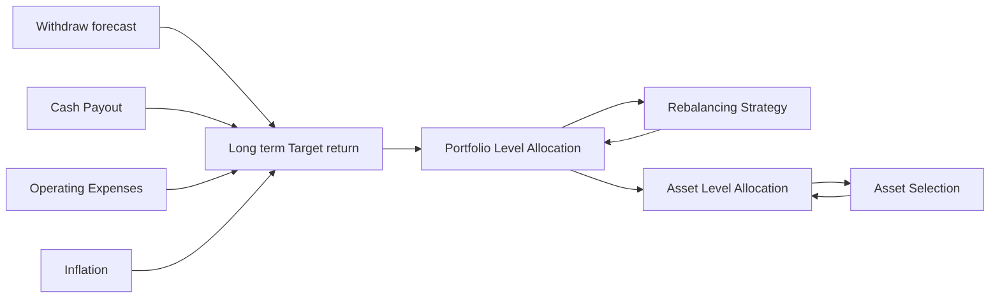

## Asset Allocation

## Portfolio Level Allocation  

### Methodology  
The portfolio will focus on ensuring liquidity and stability. We have built a three-layer structure to achieve this goal:

-  **Cash Layer:** Cash and cash equivalents calculated based on forecasted cash inflows and outflows.
-  **Protection Layer:** Designed to quickly convert to cash in emergencies, including short-term bonds and other low-risk assets.
-  **Growth Layer:** Targeted for long-term growth, including equities and other high-risk or illiquid assets.

The cash layer amount will be adjusted based on the expected net cash flow plus one standard deviation of the cash flow. It will cover all cash needs, including payouts, withdrawal forecasts, and operating expenses. In this layer, cash and cash equivalents will be held to ensure liquidity and stability. Here is the cash flow forecast:

> Cash flow forecast here

The protection layer has two objectives: to provide liquidity when the cash layer is insufficient and to keep the growth layer "untouchable." In this layer, we will allocate to short-term bonds, TIPS to hedge against inflation, and other low-risk assets. The amount in this layer will be adjusted based on two standard deviations of the cash flow forecast. This layer will employ a passive strategy to ensure portfolio stability.

The growth layer aims to achieve long-term growth. We will allocate to equities, private equity, real estate, gold, and other high-risk or illiquid assets. This layer will use an active strategy by rebalancing the portfolio and selecting assets to achieve the target return.

The layered structure has multiple benefits:

1. Ensures liquidity requirements are met.
2. Protects the growth layer from short-term market fluctuations.
3. Combines passive and active strategies to maximize the value of professional management.
4. Provides clear guidelines for the investment committee to make decisions.
5. Facilitates the use of the Mean-Variance optimization model, treating the cash and protection layers as constraints while optimizing the growth layer to achieve the target return.

However, there are also some drawbacks:

1. The layered structure relies on forecasted cash flow; if the forecast is inaccurate, the structure may not be optimal.
2. Compared to direct utilization of the mean-variance optimization model, the layered structure is more complex and may not be optimal.

We believe the benefits outweigh the drawbacks. By continuously monitoring the cash flow forecast, we can adjust the layers for each rebalancing period to ensure an optimal structure.

### Allocation Optimization

A mean-variance optimization model is used to find the optimal weights for each asset class. Our pension fund aims for long-term growth, so we used monthly data from the last 20 years to calculate the expected return and covariance matrix for each asset class. The optimization boundaries include:

1. **Target return:** Calculated based on expected cash flow and inflation rate.
2. **Cash layer requirement:** The cash layer amount will not exceed expected cash flow plus one standard deviation of the forecasted cash flow.
3. **Protection layer requirement:** The protection layer amount will not exceed two standard deviations of the forecasted cash flow.
4. **Real estate allocation:** Real estate allocation will not exceed 10% of the total portfolio.
5. **No short selling:** We will not short-sell any asset class.
6. **Private equity allocation:** Private equity allocation will not exceed 10% of the total portfolio.

The optimized asset boundary is: result here

### Index Choice

The fund aims to fully diversify the portfolio, so we choose the most representative indexes for broader asset classes.

Table over here  
-  Index name  
-  Description  
-  Reason  

## Rebalancing Strategy

> Karen is doing this part

## Asset Level Allocation

### Strategies for Different Asset Classes

The protection layer will use a passive strategy to ensure portfolio stability. The main strategy is to matching duration of the liabilities with the duration of the bonds. The liabilities is calculated based on the forecasted cash flow. The bond duration will be adjusted based on the duration of the liabilities. 

Inside the growth layer, we will use different optimization strategies for different asset classes:

- **Fixed income:** Same with the protection layer.
- **Equity:** Using Carhart（1997）Four-Factor Model to allocate the weights for each stock or funds. We aimed to acieve a positive exposure to size, value and momentum factors, since we are targeting long-term growth. 
- **Others:** Using mean-variance optimization to allocate the weights for the asset class.

> In our backtesting, we found that the Carhart（1997）Four-Factor Model outperformed the Fama-French Three-Factor Model, especially in emerging markets, momentum factor has a significant impact on the return, since we invest globally, we choose the Carhart（1997）Four-Factor Model.

### Asset Selection Process

> Karen is doing this part

## Risk Management

### Risk Management Metrics

We will monitor the weekly spread between the portfolio and the benchmark. The daily spread will be calculated as the difference between the portfolio return and the benchmark return. The risk management metrics include:

1. **95% confidence level Value at Risk (VaR):** of the weekly spread.
2. **95% confidence level Conditional Value at Risk (CVaR):** of the weekly spread.
3. **Maximum Drawdown:** of the weekly spread.

We use this 3 risk metrics as thresholds, if weekly spread exceeds the threshold, the following procedures will be taken:

#### Asset level adjustment when the risk exceeds the threshold

For asset level, we use corresponding asset index as benchmark, if:

- Exceed threshold for 4 weeks
- Reduce the weight of the asset by 10%
- Due diligence on the asset, report to the investment committee
- Exceed threshold for 8 weeks
- Reduce the weight of the asset by 20%
- Investment committee will decide whether to sell the asset and move this asset out of invest-ready pool

Example, if the asset is a equity fund, currently the weight is 10%, if the risk exceeds the threshold for 4 weeks, the weight will be reduced to 9%, if the risk exceeds the threshold for 8 weeks, the weight will be reduced to 8%, and the investment committee will decide whether to sell the asset and move this asset out of invest-ready pool.

#### Portfolio level adjustment when the risk exceeds the threshold

For portfolio level, we use the total portfolio as benchmark, if:

- Exceed threshold for 4 weeks
- Report to the investment committee
- Exceed threshold for 13 weeks(quarter)
- Trigger the rebalancing strategy

### Performance Evaluation

We will backtest the strategy using historical data and compare the performance with the benchmark. The expected return is calculated based on the mean-variance optimization model. We will also conduct sensitivity analysis on the parameters to ensure the robustness of the strategy.

